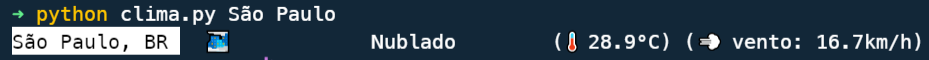
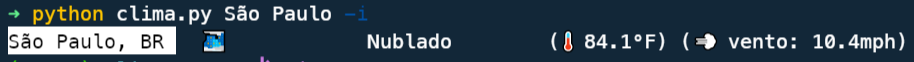
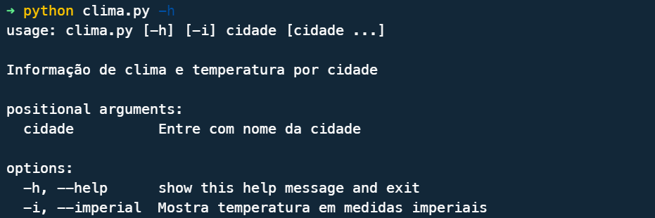

# Clima_CLI

Para utilizar primeiro você precisa fazer um cadastro no openweathermap.com e cadastrar uma chave para a API. Com isso em mãos crie um arquivo ***secrets.ini*** dentro de um novo diretório chamado de API_KEY.

```
; secrets.ini

[openweather]
api_key = sua_chave
```

Após isso pode utilizar via terminal da seguinte forma:

```
python clima.py nome_da_cidade
```
Caso queira as medidas em formato imperial, basta passar o argumento *-i* ou *--imperial*.
```
python clima.py nome_da_cidade --imperial
```
Exemplo com medidas do sistema métrico:


Exemplo com sistema imperial:


Exemplo de utilização da ajuda:
